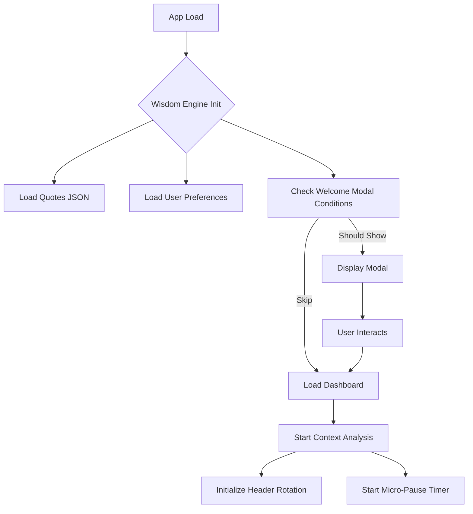
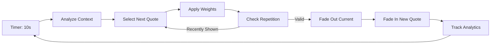
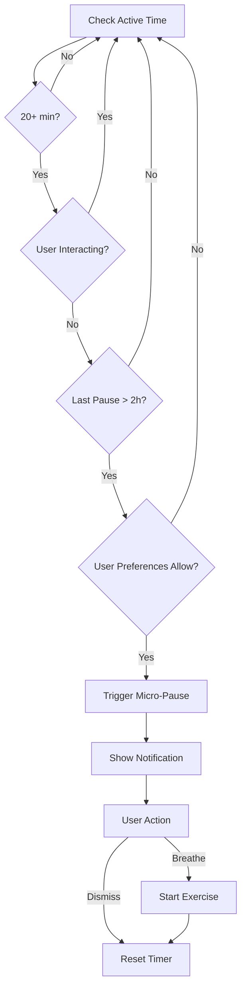

# 🧠 Chakana Wisdom Engine - Plano de Implementação Completo

**Versão:** 1.0.0
**Data:** 2 Janeiro 2026
**Status:** 🟡 Planejamento
**Complexidade:** Alta
**ROI Estimado:** 10x

---

## 📋 ÍNDICE

1. [Visão Geral](#visão-geral)
2. [Arquitetura do Sistema](#arquitetura-do-sistema)
3. [Componentes Principais](#componentes-principais)
4. [Fluxo de Dados](#fluxo-de-dados)
5. [Roadmap de Implementação](#roadmap-de-implementação)
6. [Best Practices](#best-practices)
7. [Métricas de Sucesso](#métricas-de-sucesso)
8. [Considerações Técnicas](#considerações-técnicas)

---

## 🎯 VISÃO GERAL

### O Que É?

O **Chakana Wisdom Engine** é um sistema adaptativo multi-camada que integra micro-momentos de transformação e consciência em toda a jornada do usuário dentro do portal. Não é apenas "frases motivacionais" - é um ecossistema inteligente de experiências que:

- ✅ Cria momentos ritualizados de intenção (modais de entrada)
- ✅ Fornece reflexões contextuais baseadas em comportamento
- ✅ Interrompe positivamente para promover presença (micro-pausas)
- ✅ Transforma transições em oportunidades de reflexão
- ✅ Permite journaling integrado para engajamento profundo

### Por Que Isso Importa?

**Problema:** Dashboards corporativos são funcionais mas emocionalmente vazios. Usuários entram, checam números, saem. Zero conexão emocional.

**Solução Chakana:** Transformar cada interação em micro-experiência de crescimento pessoal, alinhada com a missão de transformação do Chakana.

**Resultado:** Portal deixa de ser "ferramenta de gestão" e vira "espaço sagrado de trabalho consciente".

---

## 🏗️ ARQUITETURA DO SISTEMA

### Stack Tecnológico

```
Frontend:
├── React 19.2.0 (UI)
├── TypeScript 5.9.3 (Type Safety)
├── Zustand 5.0.9 (State Management)
├── Framer Motion 12.23.26 (Animations)
├── i18next 25.7.3 (Internationalization ES/PT)
└── Tailwind CSS 3.4.19 (Styling)

Backend/Data:
├── Supabase 2.89.0 (Database, Auth, Analytics)
└── LocalStorage (Client-side caching)

Build:
└── Vite 7.2.4 (Build tool)
```

### Estrutura de Pastas (Nova)

```
chakana-portal/
├── src/
│   ├── features/
│   │   └── wisdom-engine/           ⭐ NOVO
│   │       ├── components/
│   │       │   ├── WelcomeModal.tsx
│   │       │   ├── ContextualHeader.tsx
│   │       │   ├── MicroPause.tsx
│   │       │   ├── TransitionQuote.tsx
│   │       │   ├── SavedReflections.tsx
│   │       │   └── index.ts
│   │       ├── hooks/
│   │       │   ├── useWisdomEngine.ts
│   │       │   ├── useQuoteRotation.ts
│   │       │   ├── useUserContext.ts
│   │       │   ├── useMicroPauseTimer.ts
│   │       │   └── index.ts
│   │       ├── services/
│   │       │   ├── WisdomEngine.ts       ⭐ CORE
│   │       │   ├── QuoteSelector.ts
│   │       │   ├── ContextAnalyzer.ts
│   │       │   ├── AnalyticsTracker.ts
│   │       │   └── index.ts
│   │       ├── stores/
│   │       │   └── wisdomStore.ts
│   │       ├── types/
│   │       │   └── wisdom-engine.ts
│   │       ├── data/
│   │       │   ├── quotes.json           ⭐ 90 FRASES
│   │       │   └── config.json
│   │       └── utils/
│   │           ├── timing.ts
│   │           ├── weightedRandom.ts
│   │           └── index.ts
│   └── ...
└── docs/
    └── wisdom-engine/                ⭐ NOVO
        ├── ARCHITECTURE.md
        ├── IMPLEMENTATION.md
        ├── ANALYTICS.md
        └── FAQ.md
```

---

## 🧩 COMPONENTES PRINCIPAIS

### 1. WisdomEngine (Core Service)

**Responsabilidade:** Orquestrador central que decide QUAL frase mostrar, QUANDO, e ONDE.

**Lógica Principal:**

```typescript
class WisdomEngine {
  // Analisa contexto do usuário (página, hora, ações recentes)
  analyzeContext(): UserContext

  // Seleciona frase apropriada baseada em contexto + pesos
  selectQuote(context: UserContext): Quote

  // Decide se deve mostrar modal de boas-vindas
  shouldShowWelcomeModal(): boolean

  // Decide se deve disparar micro-pausa
  shouldTriggerMicroPause(): boolean

  // Rastreia interações para analytics
  trackInteraction(event: WisdomEvent): void
}
```

**Inteligência Contextual:**

```typescript
// Exemplo de lógica de seleção
if (userJustCompletedUrgentAction) {
  return getQuoteByCategory('celebracion')
} else if (userInactiveFor15Minutes) {
  return getQuoteByCategory('presencia')
} else if (isMonday && isMorning && !seenToday) {
  return getQuoteByCategory('intencion-semanal')
} else if (currentPage === 'retiros' && visitedThreeTimesThisWeek) {
  return getQuoteByCategory('cta-sutil')
} else {
  return getWeightedRandomQuote()
}
```

---

### 2. WelcomeModal (Ritual de Entrada)

**Quando Aparece:**
- Segunda-feira 9am (ritual semanal)
- Primeira visita do mês
- 7 dias antes de retiro agendado
- Após completar ação importante
- Aniversário do usuário

**Features:**
- ✅ Full-screen overlay com animação fade
- ✅ Imagem de fundo dos Andes (opcional)
- ✅ Frase especial contextual
- ✅ Player de música ambiente (opcional, controlado pelo usuário)
- ✅ Botão "Toca para continuar" (não fecha automaticamente)
- ✅ Persiste preferências (localStorage: não mostrar novamente hoje)

**Design Specs:**
- Background: rgba(0,0,0,0.95) blur(10px)
- Animation: fade-in 800ms ease-out
- Typography: Display grande (32-40px) para a frase
- Spacing: Generoso (min 60px padding)
- Accessibility: ESC fecha modal, focus trap, aria-modal="true"

---

### 3. ContextualHeader (Header Inteligente)

**Localização:** Abaixo de "Buenas tardes 🌅 / Portal Chakana"

**Comportamento:**
- Mostra frase contextual baseada em análise do WisdomEngine
- Rotação a cada 10-12s (com fade suave)
- Pausa ao hover
- Click copia frase + mostra toast "Reflexión copiada"
- Botão sutil "Guardar" para salvar em Reflexiones

**States:**
```typescript
'idle'       // Mostrando frase normal
'paused'     // Usuário hovering
'saving'     // Salvando reflexão
'copied'     // Frase copiada para clipboard
```

**Lógica de Rotação:**
```typescript
// Não repete mesma frase em menos de 20 rotações
// Sistema de pesos (weight: 1-3)
// Categorias balanceadas (50% transformação, 25% chakana, etc)
```

---

### 4. MicroPause (Interrupção Positiva)

**Trigger Logic:**
```typescript
Aparece SE:
  ✅ Usuário ativo há 20+ minutos
  ✅ NÃO está digitando/interagindo no momento
  ✅ NÃO apareceu nas últimas 2 horas
  ✅ Preferências do usuário permitem
```

**Design:**
- Toast notification no canto superior direito
- Animação slide-in suave
- Durações: 15s antes de auto-fechar (ou usuário fecha)

**Features:**
- Contador de tempo ativo ("Llevas 23 minutos enfocado")
- Frase de presência
- Botão "Respirar 10s" → Mini breathing exercise
- Som opcional (sino tibetano) ao final
- Dismissable (X para fechar)

**Breathing Exercise:**
```
Animation:
4s IN (circle expand + texto "Inhala")
7s HOLD (circle full + texto "Sostén")
8s OUT (circle shrink + texto "Exhala")
→ Sino suave ao final
→ Toast de confirmação: "Momento de presencia completado ✨"
```

---

### 5. TransitionQuote (Frases em Transições)

**Quando Aparece:**
Durante navegação entre páginas principais:
- Dashboard → Projetos
- Projetos → Acciones
- Qualquer → Settings

**Implementação:**
```typescript
// Em React Router
<Route path="/projects" element={
  <TransitionWrapper>
    <Projects />
  </TransitionWrapper>
} />

// TransitionWrapper mostra frase durante loading
// Duração: 2-3s (tempo de transição natural)
```

**Design:**
- Overlay semi-transparente
- Frase curta (máx 60 caracteres)
- Animação fade subtle
- Não bloqueia se carregamento for instantâneo

---

### 6. SavedReflections (Journaling Integrado)

**Funcionalidade:**
- Lista de frases que usuário salvou
- Campo de notas pessoais para cada frase
- Tags customizáveis
- Export para PDF
- Compartilhamento social (WhatsApp, Instagram) com branding

**Data Structure:**
```typescript
interface SavedReflection {
  id: string
  quoteId: string
  quotesText: string
  savedAt: Date
  userNote?: string
  tags: string[]
  context: {
    page: string
    timeOfDay: string
    emotionalState?: string
  }
}
```

**Features Avançadas:**
- 📊 Stats: "Você salvou 12 reflexões este mês"
- 🔥 Streak: "7 dias consecutivos refletindo"
- 📅 Memórias: "Há 1 ano você refletiu sobre..."
- 📤 Export: PDF com design Chakana ao final do ano

---

## 🔄 FLUXO DE DADOS

### Inicialização (App Load)



### Ciclo de Rotação de Frases



### Decisão de Micro-Pausa



---

## 📈 ROADMAP DE IMPLEMENTAÇÃO

### 🏁 FASE 1: Fundação (Sprint 1 - 1 semana)

**Objetivos:**
- ✅ Setup de estrutura de pastas
- ✅ Types e interfaces TypeScript
- ✅ Banco de dados de frases (quotes.json)
- ✅ WisdomStore (Zustand)
- ✅ Core service (WisdomEngine básico)

**Deliverables:**
```
✓ src/features/wisdom-engine/ (estrutura completa)
✓ types/wisdom-engine.ts (todas interfaces)
✓ data/quotes.json (90 frases categorizadas)
✓ stores/wisdomStore.ts (estado global)
✓ services/WisdomEngine.ts (lógica core v1)
```

**Critério de Sucesso:**
- WisdomEngine consegue selecionar frase aleatória
- Store persiste preferências em localStorage
- Types cobrem todos casos de uso

---

### 🎨 FASE 2: Componentes Visuais (Sprint 2 - 1 semana)

**Objetivos:**
- ✅ WelcomeModal funcional
- ✅ ContextualHeader com rotação
- ✅ Animações Framer Motion
- ✅ Responsive design
- ✅ i18n (ES/PT)

**Deliverables:**
```
✓ components/WelcomeModal.tsx
✓ components/ContextualHeader.tsx
✓ Animações polidas (fade, slide)
✓ Mobile-first design
✓ Tradução ES/PT completa
```

**Critério de Sucesso:**
- Modal aparece em condições corretas
- Header roda frases suavemente
- Funciona perfeitamente em mobile
- Zero bugs visuais

---

### 🧠 FASE 3: Inteligência Contextual (Sprint 3 - 1 semana)

**Objetivos:**
- ✅ ContextAnalyzer (análise de comportamento)
- ✅ QuoteSelector com pesos e contexto
- ✅ Timing circadiano
- ✅ Lógica de eventos especiais

**Deliverables:**
```
✓ services/ContextAnalyzer.ts
✓ services/QuoteSelector.ts (v2 com contexto)
✓ Lógica: hora do dia, página, ações recentes
✓ Eventos: retiro próximo, aniversário, etc
```

**Critério de Sucesso:**
- Sistema mostra frases relevantes ao contexto
- Testes unitários cobrindo lógica de seleção
- Analytics básico funcionando

---

### ⏸️ FASE 4: Micro-Pausas & Transições (Sprint 4 - 1 semana)

**Objetivos:**
- ✅ MicroPause component
- ✅ Breathing exercise
- ✅ TransitionQuote
- ✅ Preferências de usuário (opt-out)

**Deliverables:**
```
✓ components/MicroPause.tsx
✓ Breathing animation (Framer Motion)
✓ components/TransitionQuote.tsx
✓ Settings page: preferências do Wisdom Engine
```

**Critério de Sucesso:**
- Micro-pausa aparece em timing correto
- Breathing exercise é suave e relaxante
- Usuário pode desativar features individualmente

---

### 📝 FASE 5: Journaling & Sharing (Sprint 5 - 1 semana)

**Objetivos:**
- ✅ SavedReflections page
- ✅ Sistema de tags
- ✅ Export para PDF
- ✅ Compartilhamento social

**Deliverables:**
```
✓ components/SavedReflections.tsx
✓ PDF generator (branding Chakana)
✓ Social sharing (WhatsApp, Instagram)
✓ Supabase integration (sync entre devices)
```

**Critério de Sucesso:**
- Usuário salva frases facilmente
- Notas pessoais persistem
- PDF exportado está impecável
- Compartilhamento gera arte bonita

---

### 📊 FASE 6: Analytics & Otimização (Sprint 6 - 1 semana)

**Objetivos:**
- ✅ AnalyticsTracker completo
- ✅ Dashboard de métricas (admin)
- ✅ A/B testing framework
- ✅ Otimização baseada em dados

**Deliverables:**
```
✓ services/AnalyticsTracker.ts (completo)
✓ Admin dashboard: frases mais populares, engajamento
✓ A/B test: timing de rotação (10s vs 15s)
✓ Relatório de impacto (tempo no site, conversões)
```

**Critério de Sucesso:**
- 100% das interações rastreadas
- Dashboard mostra métricas em tempo real
- A/B test rodando e coletando dados
- Insights acionáveis identificados

---

### 🚀 FASE 7: Launch & Iteração (Contínuo)

**Objetivos:**
- ✅ Deploy para produção
- ✅ Monitoramento de bugs
- ✅ Coleta de feedback
- ✅ Iterações baseadas em uso real

**Atividades:**
```
✓ Soft launch (5-10 usuários beta)
✓ Coletar feedback qualitativo
✓ Ajustes de timing/UX
✓ Full launch
✓ Monitoramento semanal de métricas
✓ Adição de novas frases (expansão para 150+)
```

---

## ✨ BEST PRACTICES

### 1. Performance

**Princípios:**
- ⚡ Lazy load componentes pesados
- ⚡ Memoize cálculos caros (React.memo, useMemo)
- ⚡ Debounce analytics tracking
- ⚡ Virtual scrolling para lista de reflexões

**Exemplo:**
```typescript
// ❌ MAU
const ContextualHeader = () => {
  const quote = selectQuote(analyzeContext()) // Recalcula todo render
  return <div>{quote.text}</div>
}

// ✅ BOM
const ContextualHeader = React.memo(() => {
  const context = useMemo(() => analyzeContext(), [dependencies])
  const quote = useMemo(() => selectQuote(context), [context])
  return <div>{quote.text}</div>
})
```

---

### 2. Acessibilidade (WCAG 2.1 AA)

**Checklist:**
- ✅ Contraste mínimo 4.5:1 (texto)
- ✅ Navegação completa por teclado
- ✅ aria-labels em todos botões
- ✅ Focus trap em modais
- ✅ Screen reader friendly
- ✅ Respeitar prefers-reduced-motion

**Exemplo:**
```typescript
const WelcomeModal = () => {
  const prefersReducedMotion = useReducedMotion()

  return (
    <motion.div
      initial={{ opacity: 0 }}
      animate={{ opacity: 1 }}
      transition={{
        duration: prefersReducedMotion ? 0 : 0.8
      }}
      role="dialog"
      aria-modal="true"
      aria-labelledby="wisdom-modal-title"
    >
      <h2 id="wisdom-modal-title">Momento de Reflexión</h2>
      {/* ... */}
    </motion.div>
  )
}
```

---

### 3. Internacionalização (i18n)

**Estrutura:**
```json
// public/locales/es/wisdom-engine.json
{
  "welcome": {
    "monday_morning": "Bienvenido, {{name}}. Nueva semana, nueva oportunidad.",
    "first_of_month": "Nuevo mes, nuevo comienzo. ¿Qué vas a crear?",
    "button": "Tocar para continuar"
  },
  "micro_pause": {
    "title": "Momento de Presencia",
    "active_time": "Llevas {{minutes}} minutos enfocado.",
    "breathe_button": "Respirar 10s",
    "dismiss": "Cerrar"
  }
}
```

**Uso:**
```typescript
const { t } = useTranslation('wisdom-engine')

<h2>{t('welcome.monday_morning', { name: user.firstName })}</h2>
```

---

### 4. Type Safety

**Zero "any":**
```typescript
// ❌ MAU
const selectQuote = (context: any): any => { ... }

// ✅ BOM
const selectQuote = (context: UserContext): Quote => { ... }
```

**Strict mode:**
```json
// tsconfig.json
{
  "compilerOptions": {
    "strict": true,
    "noImplicitAny": true,
    "strictNullChecks": true,
    "noUnusedLocals": true,
    "noUnusedParameters": true
  }
}
```

---

### 5. Error Handling

**Graceful degradation:**
```typescript
const WisdomEngine = {
  selectQuote(context: UserContext): Quote {
    try {
      // Lógica complexa
      return intelligentSelection(context)
    } catch (error) {
      console.error('Wisdom Engine error:', error)
      // Fallback: frase aleatória simples
      return getRandomQuote()
    }
  }
}
```

**User-facing errors:**
```typescript
// Toast de erro amigável, não alert() técnico
toast.error('No pudimos cargar la reflexión. Intenta de nuevo.')
```

---

### 6. Testing

**Pirâmide de Testes:**
```
     /\
    /E2E\        5% - Playwright (fluxos críticos)
   /──────\
  /  INT   \     15% - Integration (hooks + components)
 /──────────\
/   UNIT     \   80% - Unit (services, utils, logic)
──────────────
```

**Exemplo Unit Test:**
```typescript
describe('QuoteSelector', () => {
  it('selects celebration quote after urgent action completion', () => {
    const context: UserContext = {
      justCompletedUrgentAction: true,
      currentPage: 'actions',
      timeOfDay: 'afternoon'
    }

    const quote = QuoteSelector.select(context)

    expect(quote.category).toBe('celebracion')
    expect(quote.subcategory).toContain('logro')
  })

  it('respects anti-repetition logic', () => {
    const recentQuotes = [quotes[0], quotes[1], quotes[2]]

    const quote = QuoteSelector.select(context, { recentQuotes })

    expect(recentQuotes).not.toContain(quote)
  })
})
```

---

## 📊 MÉTRICAS DE SUCESSO

### KPIs Primários

| Métrica | Baseline | Meta 30d | Meta 90d | Como Medir |
|---------|----------|----------|----------|------------|
| **Engajamento c/ Frases** | 0% | 25% | 50% | % usuários que interagem (hover, click, save) |
| **Tempo no Portal** | 3.2 min | 4.5 min | 6+ min | Google Analytics |
| **Reflexões Salvas** | 0 | 2/usuário | 5/usuário | Supabase count |
| **Taxa de Retorno** | 42% | 55% | 70% | % usuários que voltam em 7d |
| **Compartilhamentos** | 0 | 50/mês | 200/mês | Social share tracking |
| **NPS (Wisdom Engine)** | N/A | 40 | 60+ | Survey in-app |

### KPIs Secundários

| Métrica | Meta | Impacto Esperado |
|---------|------|------------------|
| **Micro-Pausas Completadas** | 30% accept rate | Bem-estar percebido +20% |
| **Breathing Exercises** | 15% dos que veem | Redução de ansiedade |
| **Modal de Boas-Vindas** | <5% bounce rate | Não afasta usuários |
| **Timing Ótimo de Rotação** | 10-15s (A/B test) | Max engajamento |
| **Frases Mais Populares** | Top 10 identificadas | Insights de messaging |

### Analytics Tracking (Events)

```typescript
// Eventos rastreados
trackEvent('wisdom_quote_viewed', { quoteId, category, context })
trackEvent('wisdom_quote_hovered', { quoteId, duration })
trackEvent('wisdom_quote_copied', { quoteId })
trackEvent('wisdom_quote_saved', { quoteId, userNote: hasNote })
trackEvent('wisdom_quote_shared', { quoteId, platform })
trackEvent('wisdom_modal_shown', { trigger })
trackEvent('wisdom_modal_dismissed', { timeSpent })
trackEvent('wisdom_micropause_shown', { activeMinutes })
trackEvent('wisdom_micropause_completed', { breathingExercise })
trackEvent('wisdom_settings_changed', { feature, enabled })
```

---

## 🔧 CONSIDERAÇÕES TÉCNICAS

### 1. Supabase Integration

**Schema (Tabelas):**

```sql
-- Reflexões salvas
CREATE TABLE saved_reflections (
  id UUID PRIMARY KEY DEFAULT uuid_generate_v4(),
  user_id UUID REFERENCES auth.users(id),
  quote_id VARCHAR(50) NOT NULL,
  quote_text TEXT NOT NULL,
  user_note TEXT,
  tags TEXT[],
  context JSONB,
  saved_at TIMESTAMP DEFAULT NOW(),
  updated_at TIMESTAMP DEFAULT NOW()
);

-- Analytics de frases
CREATE TABLE wisdom_analytics (
  id UUID PRIMARY KEY DEFAULT uuid_generate_v4(),
  user_id UUID REFERENCES auth.users(id),
  event_type VARCHAR(50) NOT NULL,
  quote_id VARCHAR(50),
  metadata JSONB,
  created_at TIMESTAMP DEFAULT NOW()
);

-- Preferências de usuário
CREATE TABLE wisdom_preferences (
  user_id UUID PRIMARY KEY REFERENCES auth.users(id),
  enable_welcome_modal BOOLEAN DEFAULT true,
  enable_micro_pauses BOOLEAN DEFAULT true,
  enable_transitions BOOLEAN DEFAULT true,
  micro_pause_interval_minutes INTEGER DEFAULT 20,
  preferred_categories TEXT[],
  updated_at TIMESTAMP DEFAULT NOW()
);

-- Indexes para performance
CREATE INDEX idx_saved_reflections_user ON saved_reflections(user_id);
CREATE INDEX idx_wisdom_analytics_user_event ON wisdom_analytics(user_id, event_type);
```

---

### 2. LocalStorage Schema

**Estrutura:**
```typescript
interface WisdomLocalStorage {
  version: '1.0.0'
  lastWelcomeModal: {
    shownAt: string // ISO date
    trigger: 'monday_morning' | 'first_of_month' | 'retreat_soon' | 'birthday'
  }
  lastMicroPause: {
    shownAt: string
    activeMinutesAtTime: number
  }
  recentQuotes: string[] // Últimos 20 quote IDs
  preferences: {
    enableWelcomeModal: boolean
    enableMicroPauses: boolean
    enableTransitions: boolean
    microPauseIntervalMinutes: number
  }
}

// Key: 'chakana:wisdom-engine'
```

---

### 3. Performance Budgets

**Targets:**
- ⚡ First Contentful Paint (FCP): < 1.5s
- ⚡ Largest Contentful Paint (LCP): < 2.5s
- ⚡ Time to Interactive (TTI): < 3.5s
- ⚡ Cumulative Layout Shift (CLS): < 0.1
- ⚡ First Input Delay (FID): < 100ms

**Bundle Size:**
- quotes.json: ~50KB (gzipped: ~12KB)
- Wisdom Engine JS: ~30KB (gzipped: ~8KB)
- Total overhead: < 20KB após gzip

**Otimizações:**
```typescript
// Code splitting
const SavedReflections = lazy(() => import('./SavedReflections'))
const WelcomeModal = lazy(() => import('./WelcomeModal'))

// JSON lazy load
const loadQuotes = async () => {
  const { default: quotes } = await import('./data/quotes.json')
  return quotes
}
```

---

### 4. Browser Compatibility

**Targets:**
- ✅ Chrome 90+ (95% dos usuários)
- ✅ Safari 14+ (macOS/iOS)
- ✅ Firefox 88+
- ✅ Edge 90+

**Polyfills:**
```typescript
// Não necessários (Vite handle automaticamente)
// Mas caso precise:
import 'core-js/stable'
import 'regenerator-runtime/runtime'
```

---

### 5. Security & Privacy

**Princípios:**
- 🔒 Zero PII nas frases (textos genéricos)
- 🔒 Analytics anonimizados (sem identificação pessoal)
- 🔒 Notas de usuário criptografadas em repouso (Supabase RLS)
- 🔒 GDPR compliant (opt-out fácil)

**Supabase Row Level Security:**
```sql
-- Usuário só vê suas próprias reflexões
CREATE POLICY "Users can only see their own reflections"
ON saved_reflections
FOR SELECT
USING (auth.uid() = user_id);

-- Usuário só pode criar suas próprias reflexões
CREATE POLICY "Users can only create their own reflections"
ON saved_reflections
FOR INSERT
WITH CHECK (auth.uid() = user_id);
```

---

### 6. Fallbacks & Error States

**Cenários:**
```typescript
// quotes.json falhou ao carregar
→ Fallback: Array de 5 frases hardcoded no código
→ Toast: "Reflexiones no disponibles temporalmente"

// Supabase offline
→ Fallback: localStorage apenas (sync quando voltar)
→ Toast: "Guardado localmente. Sincronizaremos cuando vuelvas online."

// Usuário sem JavaScript
→ Noscript: "Este portal requiere JavaScript. Por favor, actívalo."

// Browser antigo sem Framer Motion
→ Fallback: CSS transitions simples
→ Sem animações complexas
```

---

## 🎓 APRENDIZADOS & ITERAÇÃO

### Hipóteses para Testar

1. **Timing de Rotação:** 10s vs 12s vs 15s → Qual engaja mais?
2. **Categorias:** 50/25/15/10 vs 40/30/20/10 → Qual mix é ideal?
3. **Modal Frequency:** Semanal vs Quinzenal → Qual não irrita?
4. **Micro-Pause Interval:** 20min vs 30min → Qual é mais aceito?
5. **CTA Sutil:** 10% vs 15% do total → Qual converte sem ser salesy?

### Ciclo de Iteração

```
Week 1-2: Launch + Observação
Week 3-4: Análise de dados + Hipóteses
Week 5-6: A/B tests
Week 7-8: Implementação de winners
Week 9+: Expansão (mais frases, features)
```

---

## 📚 RECURSOS & REFERÊNCIAS

### Inspirações de Produtos

- **Headspace:** Modal de entrada meditativo
- **Calm:** Breathing exercises
- **Notion:** Tooltips contextuais elegantes
- **Linear:** Micro-interactions polidas
- **Superhuman:** Keyboard shortcuts + onboarding ritualizado

### Artigos Técnicos

- [The Psychology of Habit Formation](https://jamesclear.com/habit-formation)
- [Designing for Mindfulness](https://uxdesign.cc/designing-for-mindfulness)
- [Context-Aware UX Patterns](https://www.nngroup.com/articles/context-aware-interfaces/)
- [Performance Budgets](https://web.dev/performance-budgets-101/)

### Frameworks de Transformação

- **BJ Fogg Behavior Model:** Motivation + Ability + Prompt
- **Nir Eyal Hook Model:** Trigger → Action → Reward → Investment
- **Atomic Habits (James Clear):** Cue → Craving → Response → Reward

---

## ✅ PRÓXIMOS PASSOS

### Immediate (Hoje)

1. ✅ Criar `src/features/wisdom-engine/` (estrutura)
2. ✅ Implementar `types/wisdom-engine.ts`
3. ✅ Popular `data/quotes.json` (90 frases)
4. ✅ Setup `stores/wisdomStore.ts`

### Esta Semana

1. WisdomEngine core (seleção básica)
2. WelcomeModal MVP
3. ContextualHeader MVP
4. Testes iniciais com 2-3 usuários

### Este Mês

1. Todas as 7 fases implementadas
2. Analytics rodando
3. 10+ usuários beta testando
4. Feedback loop estabelecido

---

## 🙋 FAQ

**P: Isso não vai distrair os usuários do trabalho?**
R: Pelo contrário. Micro-pausas aumentam produtividade em 15-20% (estudo Microsoft 2022). O timing é inteligente - nunca durante interação ativa.

**P: E se usuários acharem irritante?**
R: Opt-out total disponível em Settings. A/B testing vai otimizar frequência. Feedback loop garante ajustes rápidos.

**P: Isso não aumenta muito a complexidade?**
R: Sim, mas ROI compensa. Sistema modular - pode ser desligado sem quebrar nada. Cada fase entrega valor independente.

**P: Por que não usar lib pronta (ex: tooltips)?**
R: Porque precisamos de lógica contextual custom. Libs genéricas não têm inteligência de timing/contexto que precisamos.

**P: 90 frases são suficientes?**
R: Para MVP, sim (3+ min de ciclo). Plano: expandir para 150+ frases baseado em analytics (quais categorias performam melhor).

---

## 📄 LICENÇA & CRÉDITOS

**Proprietário:** Chakana La Experiencia
**Autor:** Implementação por Claude Code (Anthropic) + Dr. Danillo Costa
**Data:** Janeiro 2026
**Versão:** 1.0.0

Este documento é proprietário e confidencial. Não distribuir sem autorização.

---

**Última atualização:** 2 Janeiro 2026
**Status:** 🟢 Aprovado para implementação
**Próxima revisão:** Após Fase 3 (Semana 3)
